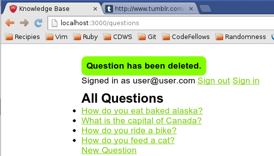
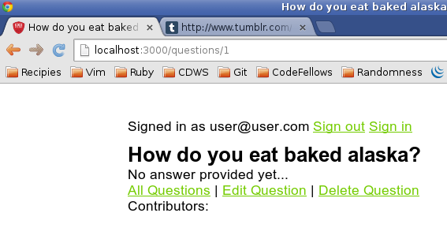
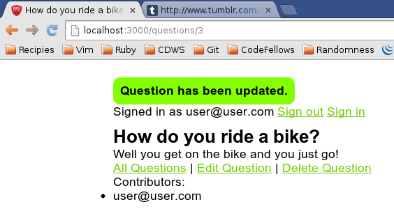

## Knowledge Base (CodeFellows - App A Day: Authentication)

By [Danielle Tucker](http://www.linkedin.com/in/dqtucker/).

###Description

**Knowledge Base** is a micro app is an online forum for posing and answering questions.  A person must be signed in to post a question or answer so that the content can be attributed to the correct person.

This app was an exercise in exploring:
* Has Many and Belongs To Relationship - Each user has and belongs to many questions.
* Authentication - each user is tracked so their contributions to the question can be logged.

###ScreenShot

### Installation
There are no known special installation instructions.

### Known Issues

If you discover any bugs, feel free to create an issue on GitHub fork and 
send us a pull request.

### Contributing

1. Fork it
2. Create your feature branch (`git checkout -b my-new-feature`)
3. Commit your changes (`git commit -am 'Add some feature'`)
4. Push to the branch (`git push origin my-new-feature`)
5. Create new Pull Request

### License

[The MIT License](LICENSE.txt)
